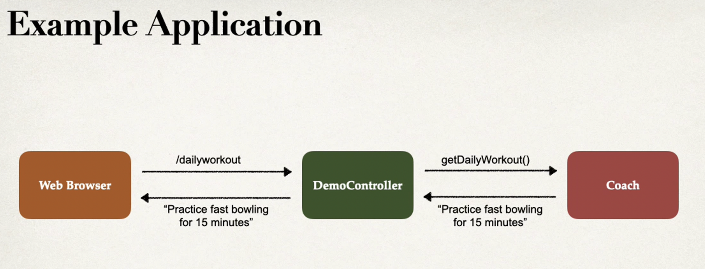

# Notes:
<!-- [links to demo](/Users/lizicheng/Desktop/java/spring/spring-boot-3-spring-6-hibernate-for-beginners-main/01-spring-boot-overview/03-actuator-demo) -->

--
Actuator
---
how: `starter-actuator`					

<br>
`/health`
`/info`
`/beans`
`/mappings`
`/threaddump`
`/auditevents`

--
common properties:
`core web security`  
log levels: `TRACE INFO DEBUG`  
context path of the app: `servlet.context-path=/my-silly-app/hello`  
Actuator: `exclude=beans,mapping` and `include=*`  
Security: `.user.name=admin` and `.user.password=8888`  
[links to spring props](https://www.luv2code.com/spring-boot-props)

--
### Inversion of Control(IoC)  
The approach of outsourcing the construction and management of objects.  
Spring container is a factory pattern  
configuration for Spring container by:  
1. java annotations  
2. java source code  

---
### Depndency injection
1. constructor injection
2. setter injection

---

  

  

`@Componment` is a SpringBean  
`@Autowired` Spring look for a class that match, by type: class or interface  
`no usages` because Spring do the work behind  
### behind the scenes  
Help you automatically new objects  
### Setter injection  
use the autowried for setter methods

---
component scanning: scanning the same packages  
explicitly scanning: scanBasePackages={"www.luv.com"}  

---
for multiple beans, we can use `@Qualified`  
`@Qualifier("baseballCoach")` the bean id is the first letter is lowercase, the same as the class name  
We can use `@Primary` on the class name.
`@Qualifier` has higher priority than `@Primary` 

---
By default, all beans are initialized, every class will be newed.  
### lazy initialization  
only when the class is needed, created it. We can use `@Lazy`  
global configuration: `spring.main.lazy-initialization=ture`  
### beans scope
the lifecycle of bean  
how many objects are created  
how long the bean lives  
The default bean is singleton  
Explicit bean scope: `@Scope` use this at the class file
* protottpe scope: `@Scope socpe_prototype` 
* request
* session
* global-session  

`@Scope(ConfigurableBeanFactory.SCOPE_PROTOTYPE)`  
`@GetMapping("/check")
public String check() {
return "Compare the two coaches: coach == anothercoach, " + (myCoach==anotherCoach);
}`  
### lifecycle of bean
Bean lifecycle method  
`@PostConstruct` once Spring started running  
`@PreDestroy` once Spring finished running  
**For "prototype" scoped beans, Spring does not call the destroy method. Gasp!**  
**Prototype beans are lazy by default. There is no need to use the @Lazy annotation for prototype scopes beans.**    

In contrast to the other scopes, Spring does not manage the complete lifecycle of a prototype bean: the container instantiates, configures, and otherwise assembles a prototype object, and hands it to the client, with no further record of that prototype instance.

Thus, although initialization lifecycle callback methods are called on all objects regardless of scope, in the case of prototypes, configured destruction lifecycle callbacks are not called. The client code must clean up prototype-scoped objects and release expensive resources that the prototype bean(s) are holding.  

### configuration for beans  
used `@Beans` because sometimes have no access to the thrid party source code, but need to make that class available for the bean  
Example: AWS S3 cloud, we want to communicate our app with the S3 service.  
The bean id is default to the method name. `public Coach swimCoach()` change the id of bean `@Bean("badname")`  

# 03

### Hibernate & JPA  
Hibernate is a framework that persisting the Java objects in the database.  
* handle low level sql operations
* provide Object-to-Relational Mapping

It can map the Java code to sql create table  
JPA: Jakarta Persistence API, it is a specification  
JPA allow us to do sql jobs using only Java. JPA is another abstract layer on top of JDBC. `EntityManager`  
We can use commandlineRunner to execute: `return runner -> {
System.out.println("Hello World!");
}`  
you can set up the connection to database: `spring.datasource.url=jdbc:mysql://localhost:3306/student_tracker`  
`Entity Classes` is a java class that maps the database table. Annotations `@Entity`. The class must have public or protected constructor.  
`@Column`, `@Table` is optional, but recommended. The default name of the table and column will be the same as the class name.  
`GenerationType.AUTO`, `GenerationType.IDENTITY`, `GenerationType.SEQUENCE`, `GenerationType.TABLE` 
### Bonus: 
you can define your own custom generation strategy.  
`Project Lombok` 
### CRUD  
Create, read,update and delete  
DAO: Date Access Object, kind of like a helper class for communicate with the database  
Steps: 
1. Define DAO interface
2. Define DAO implementation, inject the entity manager
3. update main app  

saving a java object
handled transaction management: `@Transactional`, for DAO: `@Repository` just like `@Component`  

The difference between beans and components:  
1. @Component is a class-level annotation, but @Bean is at the method level, so @Component is only an option when a class's source code is editable. @Bean can always be used, but it's more verbose.  
2. @Component is compatible with Spring's auto-detection, but @Bean requires manual class instantiation.  
3. Using @Bean, decouples the instantiation of the bean from its class definition. This is why we can use it to make third-party classes into Spring beans. It also means we can introduce logic to decide which of several possible instance options for a bean to use.

creating a new method `private void createStudent(StudentDAO studentDAO)` then `studentDAO.save(tempStudent);`, inside the DAOimplement `public void save(Student theStudent) {
entityManager.persist(theStudent);
}`  
### save multiple students
we can test multiple students in Java.  
we can change the index of MySQL `ALTER TABLE student_tracker.student AUTO_INCREMENT=1000`  
we can also TRUNCATE the index of MySQL `TRUNCATE student_tracker.student`  
### retrieve objects
we don't need to add `@Transactional` because we just retrieved the objects, no modification.
use:`@Override
public Student findById(Integer id) {
return entityManager.find(Student.class, id);
}`  
Steps:
1. Define DAO interface
2. Define DAO implementation, inject the entity manager
3. update main app
## !important  
`public Student() {
    }`  
In JPA and some beans, we have to have a default constructor, otherwise it will throw an exception.  
`Student myStudent = studentDAO.findById(theId);`  
### query objects
JPA have its query language called JPQL, based on the entity name and entity field name  
we can first create a query object using TypedQuery  
`TypedQuery<Student> query = entityManager.createQuery("FROM Student order by lastName desc", Student.class);`  
inside the query, we can say order by lastName desc.  
Then we can return the query  
`return query.getResultList();`  
we can also have a method:  
`private void queryStudent(StudentDAO studentDAO) {
List<Student> students = studentDAO.findAll();
        for (Student student : students) {
            System.out.println(student);
        }
	}`  
**note that all name in the query is entity field name, not the real column name or table name in MySQL.** e.g. lastName  
JPQL named parameters are prefixed with a colon, think of that as the placeholder, `:lastName`  
the code: 
``` 
public List<Student> findByLastName(String thelastName) {
        // create query
        TypedQuery<Student> query = entityManager.createQuery("FROM Student where lastName = :lastName order by lastName desc", Student.class);

        // set parameter
        query.setParameter("lastName", thelastName);

        // return query results
        return query.getResultList();
    }
   private void queryStudentByLastname(StudentDAO studentDAO) {
		// get a list of all students
		List<Student> students = studentDAO.findByLastName("jin");

		//display all students
		for (Student student : students) {
            System.out.println(student);
        }
	}
```
### update object
 we need to add `@Transactional` 
code:
```
public void update(Student theStudent) {
        entityManager.merge(theStudent);
    }
    
    private void updateStudent(StudentDAO studentDAO) {
		int id=1;
		System.out.println("Retrieving student with id: " + id);
		Student student = studentDAO.findById(id);

		student.setFirstName("Scooby");
        System.out.println("Updating student with id: " + id);
		studentDAO.update(student);
		System.out.println("Updated student: " + student);
	}
```  
### delete object
code:
```
@Transactional
    public int deleteAll() {
        int numberOfRows = entityManager.createQuery("DELETE FROM Student").executeUpdate();
        return numberOfRows;
    }
    private void deleteAllStudent(StudentDAO studentDAO) {
		System.out.println("Deleting all students");
		int count=studentDAO.deleteAll();
		System.out.println("Deleted "+count+" rows students");
	}
```  
### create table using Java
inside the property file:  
PROPERTY-VALUE  
1. none
2. create-onlu
3. **create** this will first drop table if existed, then create table. Don't recommend for company use because it will lose any previous data.
4. drop
5. create-drop
6. validate
7. **update** it will keep the existing data

Be caution with update model. it will keep updated the table with latest code.  
### REST API 
business problems: we want to create an app provides the weather report for a city  
Application architecture: my weather app will pass a `string` city name to the external service to give the data.  
we can make REST API calls over HTTP in order to connect to the service. REST is independent to language, the client can use any language, and service can use any language.  
REST can use any data format. XML, JSON  
use the online weather service API provided by [API](https://www.openweathermap.org) we can read the API documentation. 
REST calls can be made over HTTP  
We will create a CRM service.  
JavaScript Object Notation: JSON  
The left part of the pair, is always double quotes, nested JSON objects, JSON arrays: use `["","","","","","]`  
### REST HTTP CURD
`POST` : create an entity  
`GET` : read a list of entities  
`PUT` : Update an entity  
`DELETE` : delete an entity 
Request message: request line, Header, Body
Response message: response line, Header, Body  
range: 100-199: informational, 200-299: successful, 300-399: Redirection, 400-499: client error, 500-599: server error  
message format: MINE content type, Multipurpose Internet Mail-Extension. Basic syntax: type/sub-type, e.g. text/html, text/plain  
Client tools for send HTTP requests to the REST web service/API. e.g. curl, postman.  
for advanced REST testing: POST, PUT use Postman for better support.  
So what we did is, the REST API is the backend, we are creating endpoint, we can write `@RestController`, `@GetMapping` 
code:
```
@RestController
@RequestMapping("/test")
public class DemoRestController  {
    @GetMapping("/hello")
    public String hello(){
        return "hello world";
    }
}
```
so when we visit `/hello, it will return hello world.  
### Java JSON Data Binding
Data binding is the process of converting JSON data to JAVA POJO.  
Spring use Jackson project behind the scenes, handling data binding, call setter method go from JSON to POJO. Have to have setter method, match the name of JSON.  
Jackson call getter method go from POJO to JSON.  
spring automatically use Jackson, JSON pass to the REST controller is converted to POJO, java object returned from REST controller is converted to JSON.  
### create a new service for student
code:
````agsl
@RestController
@RequestMapping("/api")
public class StudentRestController {
    @GetMapping("/students")
    public List<Student> getAllStudents() {
        List<Student> students = new ArrayList<>();
        students.add(new Student("Smith", "John"));
        students.add(new Student("Mary", "Zuick"));
        students.add(new Student("qxc", "Ted"));
        return students;
    }
````
````agsl
public class Student {
    private String lastName;
    private String firstName;
````
### path variable
retrieve a single student by id. `/api/students/{studentId}`  
we can use `@PostConstruct` to construct date only once when bean created, we can use `@PathVariable` for `/{studentId}`  
````agsl
    @GetMapping("/students/{studentId}")
    public Student getStudent(@PathVariable("studentId") int studentId) {  // by default, variables name should match
        return students.get(studentId);
    }
````  
### exception handling
1. create StudentErrorResponse class
2. create StudentNotFoundException extends RuntimeException
3. make a if statement
4. use `@ExceptionHandler`
code for the index out of range exception:
we need to first throw an exception
````agsl
// check the student id against list size
        if((studentId >= students.size()) || (studentId < 0)) {
            throw new StudentNotFoundException("student id not found" + studentId);
        }
````  
then we can create the error response
````agsl
public ResponseEntity<StudentErrorResponse> handleException(StudentNotFoundException exc) {
        // create a StudentErrorResponse
        StudentErrorResponse errorResponse = new StudentErrorResponse();
        errorResponse.setStatus(HttpStatus.NOT_FOUND.value());
        errorResponse.setMessage(exc.getMessage());
        errorResponse.setTimeStamp(System.currentTimeMillis());
        // return ResponseEntity
        return new ResponseEntity<>(errorResponse,HttpStatus.NOT_FOUND);
    }
````  
### exception handling for general case
````agsl
@ExceptionHandler
    public ResponseEntity<StudentErrorResponse> handleException(Exception exc) {
        // create a StudentErrorResponse
        StudentErrorResponse errorResponse = new StudentErrorResponse();
        errorResponse.setStatus(HttpStatus.BAD_REQUEST.value());
        errorResponse.setMessage(exc.getMessage());
        errorResponse.setTimeStamp(System.currentTimeMillis());
        // return ResponseEntity
        return new ResponseEntity<>(errorResponse,HttpStatus.BAD_REQUEST);
    }
````
### global exception handling
now it is only for 1 REST controller, but we need for all other controllers. So we need to have global.  
**Aspect-oriented programming**  
globalExceptionHandler is best practice for large projects  
code:
```agsl
@ControllerAdvice
public class StudentRestExceptionHandler{
 // the same exception as above
}
```  
### API design process
1. review API requirements
2. Identify main resource / entity
3. use HTTP method to assign action on resource  

   `POST` : /api/employees create an entity  
   `GET` : /api/employees or /api/employees/{employeeId} read a list of entities  
   `PUT` : Update an entity  
   `DELETE` : delete an entity  

do not do:
include the action in the endpoints  
do: use HTTP method to assign action on resource  
convention is to use plural form on API  
### create JPA DAO
standard JPA DAO API  
first create entity package and employee class, then create DAO interface and implement  
code:
```agsl
@Autowired
    public EmployeeDAOImp(EntityManager entityManager) {
        this.entityManager = entityManager;
    }
    public List<Employee> findAll() {

        // create a query
        TypedQuery<Employee> query = entityManager.createQuery("from Employee", Employee.class);

        // execute the query
        List<Employee> results = query.getResultList();

        // return the results
        return results;
    }
```  
code for EmployeeRestController:
```agsl
@RestController
@RequestMapping("/api")
public class EmployeeRestController {
    private EmployeeDAO employeeDao;
    public EmployeeRestController(EmployeeDAO employeeDao) {
        this.employeeDao = employeeDao;
    }
    @GetMapping("/employees")
    public List<Employee> findAll() {
        return employeeDao.findAll();
    }
```
Now we need to have a service layer implementation, which is between REST controller and DAO. It is **service facade** design pattern  
it can integrate multiple data sources, e,g. Skills dao, Payroll dao. it is common to see in large Enterprise applications.  
specialized annotations for services, `@Service` is a mutation of `@Component`  
remember do the injection for every component  
### add, save, delete for DAO
remember to add `@Transactional` on the service layer, no the DAO.  
code for DAO:  
```agsl
@Override
    public Employee save(Employee employee) {
        //save the employee
        Employee dbEmployee= entityManager.merge(employee);  // if id is ==0, then insert the employee, else update

        // return the dbEmployee
        return dbEmployee;
    }
```  
code for service layer.
```agsl
@Transactional
    @Override
    public void deleteById(int id) {
        employeeDAO.deleteById(id);
    }
```  
### in the REST controller
code for GET
```agsl
// add mapping for GET /employees/{employeeId} by Id
    @GetMapping("/employees/{employeeId}")
    public Employee getEmployee(@PathVariable int employeeId) {
        Employee employee = employeeService.findById(employeeId);
        if(employee == null) {
            throw new RuntimeException("employee id not found" + employeeId);
        }
        return employee;
    }
```  
code for POST
````agsl
@PostMapping("/employees")
    public Employee addEmployee(@RequestBody Employee employee) {
        // set the id to 0 in case of they pass an id to Json
        // this is force a save of new item
        employee.setId(0);
        Employee dbemployee = employeeService.save(employee);
        return dbemployee;
    }
````  
code for PUT:
```agsl
@PutMapping("/employees")
    public Employee updateEmployee(@RequestBody Employee employee) {
        Employee dbemployee = employeeService.save(employee);
        return dbemployee;
    }
```  
mistake I made, `@PutMapping("/employees/")`  
code for DELETE  
```agsl
@DeleteMapping("/employees/{employeeId}")
    public String deleteEmployee(@PathVariable int employeeId) {

        Employee dbemployee = employeeService.findById(employeeId);
        // check for exception
        if (dbemployee == null){
            throw new RuntimeException("employee id not found" + employeeId);
        }
        employeeService.deleteById(employeeId);

        return "delete employee # " + employeeId;
    }
```  
### 06-jpaRepository
use CRUD methods for every DAO, no need to implement the class. use the Spring Data JPA, no need to write DAO implement code.  
we can remove the ` @Transactional` since we use the JPA interface.  
interface:
```agsl
public interface EmployeeRepository extends JpaRepository<Employee, Integer> {
    // that is it, no need to write anything
}
```
new feature in Java 8 using the optional:
````agsl
@Override
    public Employee findById(int id) {
        Optional<Employee> result = employeeRepository.findById(id);
        Employee employee = null;
        if (result.isPresent()) {
            employee=result.get();
        }
        else {
            throw new RuntimeException("Couldn't find employee" + id);
        }
        return employee;
    }
````
### 07-JPA for rest endpoint
the same method as above  
only need 3 items for Spring data REST:  
1. the entity: Employee
2. Jpa repository extends jpaRepository
3. Maven POM dependency: 

terminology: HATEOAS: Hypermedia as the Engine of Application State: the meta-data for REST  
We can add dependencies 
```agsl
<dependency>
			<groupId>org.springframework.boot</groupId>
			<artifactId>spring-boot-starter-data-rest</artifactId>
		</dependency>
```
we don't need controller and services package. spring will be provided. we only need the entity  
noticed, for the rest endpoint, when we try PUT we need to use `http://localhost:8080/magic-api/employees/5` we need to specify the id in the URL.  
### pluralized forms for REST
problems: some words can not have the plural forms are complex.  
properties available for application. 
we can use `@RepositoryRestResource(path="members")` to change the path name.
we can also use sorting, sorting by last name. `http://localhost:8080/magic-api/employees?sort=lastName,desc`  
pagination: `spring.data.rest.default-page-size=3`

## spring security
implementing spring Servlet filters, two methods of securing: declarative and programmatic.
### declarative security
use `@Configuration` 
use spring.security.user.name=scott  
we can use `spring.security.user.password=test123` to modify username and password  
### configuration for security 
1. create a new class
```agsl
@Configuration
public class DemoSecurityConfig {
    @Bean
    public InMemoryUserDetailsManager userDetailsManager() {
        UserDetails susan = User.builder()
                .username("susan")
                .password("{noop}test123")
                .roles("EMPLOYEE", "MANAGER", "ADMIN")
                .build();
        return new InMemoryUserDetailsManager(john, mary, susan);
    }
}
```
### restricting access to roles
cross site request forgery(CSRF) generally, we don't need to use CSRF for stateless REST api.  
code:
```agsl
@Bean
    public SecurityFilterChain filterChain(HttpSecurity http) throws Exception {
        http.authorizeHttpRequests(configurer ->
                configurer
                        .requestMatchers(HttpMethod.GET, "/api/employees").hasRole("EMPLOYEE")
                        .requestMatchers(HttpMethod.GET, "/api/employees/**").hasRole("EMPLOYEE")
                        .requestMatchers(HttpMethod.POST, "/api/employees").hasRole("MANAGER")
                        .requestMatchers(HttpMethod.PUT, "/api/employees").hasRole("MANAGER")
                        .requestMatchers(HttpMethod.DELETE, "/api/employees/**").hasRole("ADMIN")
        );
        // use HTTP Basic authentication
        http.httpBasic(Customizer.withDefaults());
        // disable CSRF, in general, not required for stateless REST APIs
        http.csrf(csrf -> csrf.disable());
        return http.build();
    }
```


